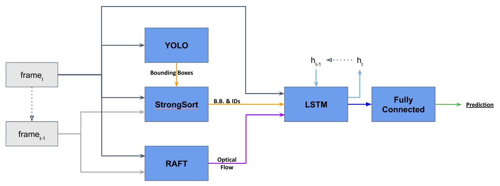

Sapienza University project for Vision and Perception 2022.  
Students: [Edoardo Colonna](https://github.com/Colonna17), [Lapo Carrieri](https://github.com/lapocarrieri) and [Silverio Manganaro](https://github.com/Silver0x10).

# 
 Abstract 

Nowadays one of the hottest topics in the AI area is autonomous driving. It heavily relies on new technologies from computer vision to achieve results that otherwise would not make it possible to use self-driving cars. However, many improvements are still needed in this field. Our project aims to develop a method for object detection in adverse weather conditions in autonomous driving . We'll start by comparing our results with actual benchmarks by using pre-trained models. Then, by using outputs from the first part of the work, we will train a model to track the vehicles frame by frame. Finally, we will focus on estimating object direction of motion in order to generate a collision detection method, in line with current literature on the subject.

 

# 
 Dataset 

We'll try to obtain a model having similar performance with respect to the following dataset:

- [V&P 2022](https://universe.roboflow.com/eddyprojects/v-p-2022/dataset/9), a dataset created by ourself that contains "all weather conditions"; it has 1000 images with thousands of Objects labelled with accurate 2D bounding boxes using 7 classes.

- [Car Crash Dataset](https://github.com/Cogito2012/CarCrashDataset) given its specialisation in traffic accident scenes; it has more than 1500 accident videos with labels and accident reasons descriptions

 

# 
 Project 
 
The project is composed by many models that are combined on the final classifier that defines the probability of an accident.
For the project are used images in bad weather conditions to specialize the system. 
The models used are a customize model of YOLO trained with images of our dataset, a re-identification model that let the bounding boxes being tracked all time for every frame, and finally a dense optical flow estimator.
The last layers of the whole architecture combine all the previous results to generate a single prediction.

 

## 
 Yolo custom training 

  We assemble a dataset and train a custom [YOLOv5](https://github.com/ultralytics/yolov5) model to recognize the objects in our dataset. To do so we will take the following steps:
- Gather a dataset of images and label our dataset (using Roboflow)
- Export our dataset to YOLOv5
- Train YOLOv5 to recognize the objects in our dataset
- Evaluate our YOLOv5 model's performance 
- Run test inference to view our model at work
- Train many models with different hyperparameters and compare the obtained performance
- Download the weights corresponding to the best model obtained

 

  

## 
 Tracking  

The second step to obtain a classifier is the use of Strongsort in order to keep track of the bounding boxes and mantain the indexes of them. This improve significally the performance of the model with respect to other computer vision models. 

 

 

  

## 
 Optical Flow 
 

The last type of information used to classify a scene is the optical flow. We decided to use [RAFT](https://arxiv.org/abs/2003.12039) to get a dense estimation of the motion. The documentation of the [pytorch implementation](https://github.com/pytorch/vision) we used can be found [here](https://pytorch.org/vision/main/models/raft.html).

  
  

## 
 Car Crash Prediction 
 

The final step is the integration of all the modules introduced above so as to encode the current frame together with the extracted information to generate a prediction.

  
 
The final output is therefore the probability that an accident occurs in the analyzed frame, taking into consideration the entire sequence of events seen so far. 

  
 

  

# 
 Results and Future works 
 

The results of our models are not so satysfying with respect to S.O.T.A. similar models. 

  
 

## What went wrong?
We think the main reasons for these results are:
- Too little emphasis was given to frames with collisions
- The encoding layers should be wider and deeper than they are now
- Bad weather conditions are difficult to overcome without the ability to take advantage of other sensors than RGB cameras (i.e. LiDAR and RADAR)

## Possible improvements
This project could be a very good start for future developements due to the potential of all the models used.  
In particular, we have thought about the following improvements/technologies:
- Sparse Optical Flow
- Deeper classification architecture
- Understanding of entities involved in a collision
- 3D bounding boxes
- Integrations of other sensors 
- **Real-Time implementation**

Here you can **try our final model**:

 

  

